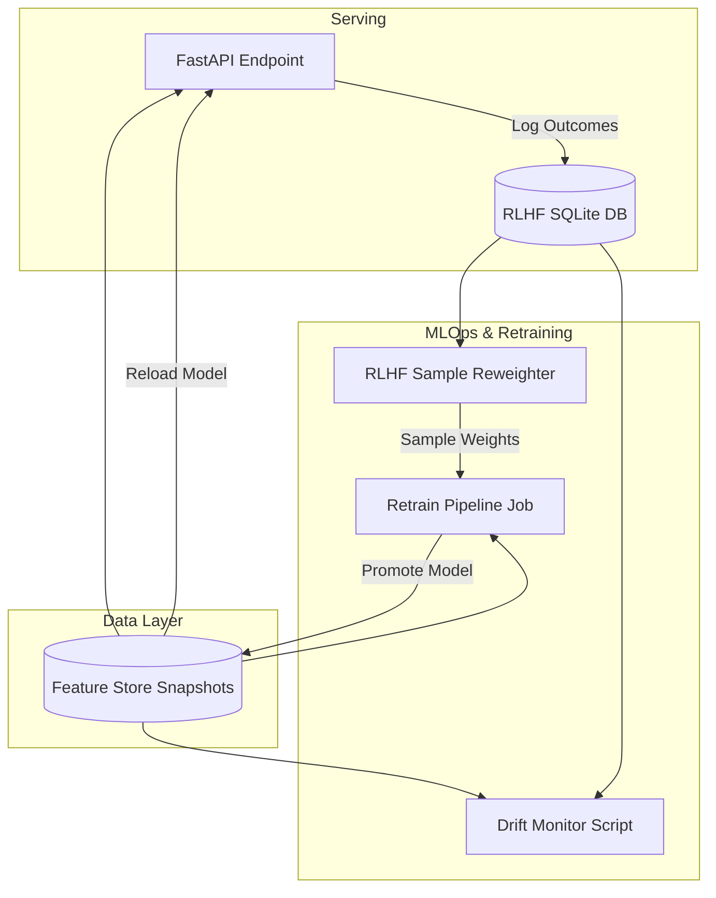

# MLOps Architecture Documentation

This document describes the closed-loop MLOps architecture, drift monitoring, RLHF sample reweighting, and automated retraining pipelines for the Intelligent Customer Churn platform.

---

## 1. System Architecture Overview

The system operates as a closed loop between prediction, monitoring, logging, and retraining:

---

## 2. Drift Detection Mechanism

Two parallel monitoring checks run continuously via `drift_monitor.py`:

### A. Feature Drift (PSI)
- **Metric**: Population Stability Index (PSI) computed weekly for every column.
- **Formulas**:
  \[PSI = \sum \left( (Actual\% - Expected\%) \times \ln\left(\frac{Actual\%}{Expected\%}\right) \right)\]
- **Actions**:
  - `PSI < 0.10`: Feature stable. No action.
  - `0.10 <= PSI <= 0.20`: Mild warning. Logged to the Streamlit status panel.
  - `PSI > 0.20`: Significant drift. Triggers an alert and flags the automated retraining pipeline run.

### B. Model Performance Decay
- **Metric**: Rolling 30-day ROC-AUC computed on logged outcomes.
- **Actions**:
  - If the ROC-AUC falls by more than **5%** below the baseline deployment metric, a performance alert is logged and auto-retraining is triggered.

---

## 3. RLHF Feedback Loop

The RLHF (Reinforcement Learning from Human Feedback) system closes the loop by logging client retention outcomes to SQLite (`rlhf_outcomes.db`) via the `POST /outcome` endpoint.

### Sample Reweighting Rules:
1. **Successful Interventions (`outcome = 1`)**:
   - The customer was flagged as high-risk, a coordinator applied a strategy, and the customer was retained.
   - **Weight = 2.0**: We up-weight this sample so the model learns features of customers who are receptive to interventions.
2. **Failed Interventions (`outcome = 0`)**:
   - The customer was flagged as high-risk, a strategy was applied, but the customer churned anyway.
   - **Weight = 0.5**: We down-weight this sample so the model reduces penalty on profiles that cannot be retained.
3. **No Intervention (`default`)**:
   - **Weight = 1.0**.

---

## 4. Retraining Pipeline Sequence

When a drift trigger fires, the automated pipeline executing `retrain_pipeline.py` executes in seven steps:

1. **Pull Snapshot**: Merges the latest Parquet feature store snaps.
2. **Load weights**: Fetches sample weights computed by `rlhf_reweighter.py`.
3. **Model Fit**: Trains XGBoost using the baseline hyperparameters and sample weights.
4. **Safety Check**: Compares candidate test ROC-AUC with production model ROC-AUC. Rejects candidate if `new_auc < prod_auc - 0.02`.
5. **Register**: Logs the new version to MLflow.
6. **Promotion test**: Copy model to Staging and runs automated API test suites (`tests/test_api.py`).
7. **Deploy**: Overwrites production `xgboost_model.pkl` and archives the backup model.
